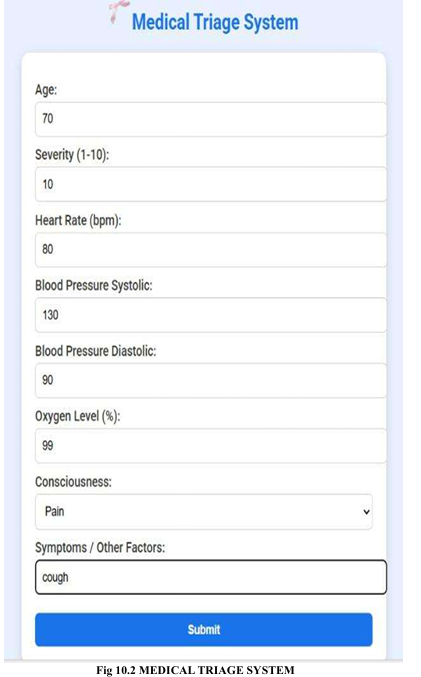
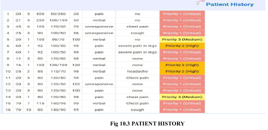
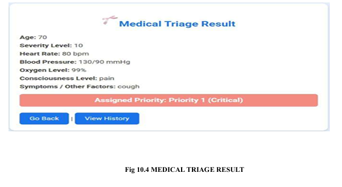
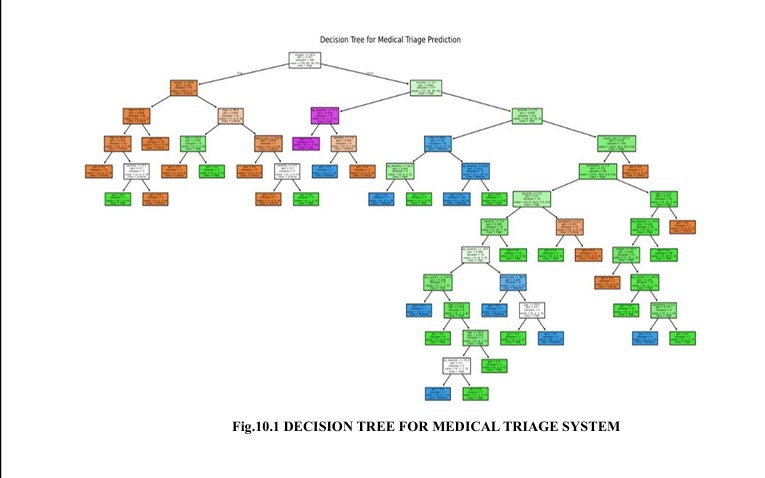

# Quantum-Inspired Medical Triage Prioritization System

A machine learning-based medical triage system with quantum-inspired prioritization for emergency patient classification.

## 📌 Project Overview

The Quantum-Inspired Medical Triage Prioritization System is a web-based application designed to assist in prioritizing patients based on the severity of their medical condition.

The system combines machine learning with a quantum-inspired probability simulation to classify patients into different priority levels. It considers clinical parameters such as age, severity, heart rate, blood pressure, oxygen saturation, consciousness level, and symptoms.

## 🎯 Objectives

* Prioritize patients based on clinical parameters.
* Use machine learning for automated triage classification.
* Incorporate a quantum-inspired probability mechanism into the prioritization process.
* Provide a simple web interface for entering patient information.
* Store patient records using a database.
* Support faster and more consistent triage decision-making.

## 🚀 Key Features

* Machine learning-based patient classification
* Quantum-inspired prioritization
* Patient data management
* Emergency priority classification
* Flask-based web application
* SQLite database integration
* Decision Tree / Random Forest machine learning model
* Prediction visualization
* User-friendly interface

## 🧠 Technologies Used

* Python
* Flask
* Scikit-learn
* Pandas
* NumPy
* Joblib
* SQLite
* HTML
* CSS
* Machine Learning
* Quantum-inspired simulation

## ⚙️ How It Works

1. Patient information is entered through the web application.
2. Clinical parameters are processed by the system.
3. The trained machine learning model predicts the patient's triage priority.
4. A quantum-inspired probability simulation is incorporated into the prioritization process.
5. The final priority level is displayed to the user.
6. Patient information can be stored in the SQLite database.

## 📊 Machine Learning

The project uses supervised machine learning to predict patient priority based on clinical characteristics.

The model considers parameters including:

* Age
* Severity
* Heart rate
* Systolic blood pressure
* Diastolic blood pressure
* Oxygen saturation
* Consciousness
* Symptoms

The trained model is saved as:

`triage_model.pkl`

## ⚛️ Quantum-Inspired Component

The system includes a quantum-inspired simulation concept that uses probability-based decision mechanisms to enhance the prioritization process.

This is a **quantum-inspired simulation**, not execution on a physical quantum computer.

## 🗂️ Project Structure

```text
quantum-inspired-medical-triage/
│
├── static/
├── templates/
├── home.png
├── triage.png
├── result.png
├── decision_tree.png
├── app.py
├── check_db.py
├── database.py
├── quantam.py
├── quantum_test.py
├── train_model.py
├── triage_model.pkl
├── medical_triage_dataset.csv
├── requirements.txt
├── .gitignore
└── README.md
```

## 🖥️ Application Screenshots

### 🏠 Home Page



### 🏥 Patient Triage



### 📈 Prediction Result



### 🌳 Decision Tree



## ⚠️ Disclaimer

This project is developed for **educational and research purposes only**.

It is not intended to replace professional medical judgment, diagnosis, or real-world clinical decision-making.


### 🏥 Patient Triage


### 📈 Prediction Result


### 🌳 Decision Tree


